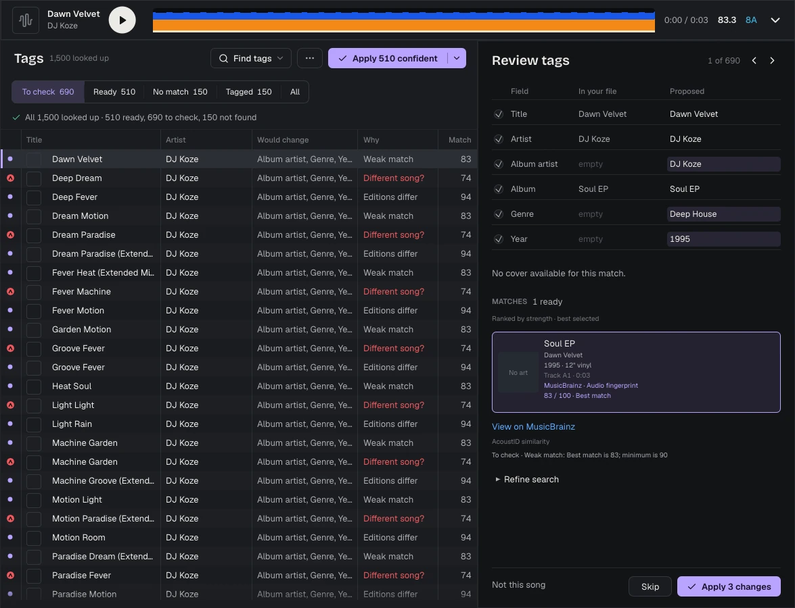
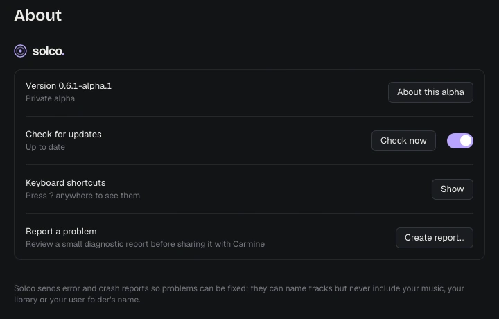
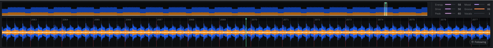

# Solco

Solco is the prep studio for DJs. It grids every track you add, keys it, hears
its genre and character, fixes its tags and files it into smart playlists. Then
it writes the USB drive your CDJs read, no rekordbox needed. Every analysis runs
on your own computer, and you can still do any of it by hand.

This is where Solco's builds, updates and support issues live. Learn more at
[getsolco.com](https://getsolco.com).

## Download

**[Download the latest release](https://github.com/crmne/solco-releases/releases)**
(the newest build is at the top of the list).

| Platform | File |
| --- | --- |
| macOS (Apple Silicon) | `solco-…-macos-arm64.dmg` |
| Windows | `solco-…-x86_64-pc-windows-msvc-setup.exe` (installer) or the `.zip` (portable) |
| Linux, Debian and Ubuntu | `solco_…_amd64.deb` or `solco_…_arm64.deb` |
| Linux, Fedora | `solco-….x86_64.rpm` or `solco-….aarch64.rpm` |
| Linux, any distribution | `solco-…-x86_64-unknown-linux-gnu.tar.gz` or `solco-…-aarch64-unknown-linux-gnu.tar.gz` (portable) |

Solco is in alpha. Builds are free, need no account or license key, and run for
30 days after their release, by which time a newer one is out. Keep a backup of
your music and library, and use a spare drive for your first exports.

### Check your download

Each release includes `checksums.txt` with the SHA-256 of every file. Download it
next to your file, then:

- **Linux:** `sha256sum --check --ignore-missing checksums.txt`
- **macOS:** `shasum -a 256 solco-*.dmg`, and compare with the line in `checksums.txt`
- **Windows (PowerShell):** `Get-FileHash solco-*-setup.exe`, and compare with the line in `checksums.txt`

## Updates

Solco checks this page for a newer release when it starts and once a day after
that. When one is out, a slim banner appears under the title bar. Nothing is
downloaded until you click **Download**. **Restart to update** then closes Solco
the usual way, asking about anything still running, and opens the new version.
If the new version does not start, the previous one comes back.

Every update is verified against Solco's publisher signature before it is
installed. Turn checks off, or check now, in **Settings › About**.

- The macOS app, the Windows installer and the portable Windows and Linux
  archives update themselves.
- A DEB or RPM installed through your package manager updates by installing the
  new package from this page.
- When a release changes the bundled analysis models, its release notes ask
  portable copies to download the full archive once.

## System requirements

- **macOS:** 13.4 or later, on Apple Silicon. Intel Macs are not supported.
- **Windows:** 64-bit (x86-64).
- **Linux:** 64-bit x86-64 or ARM64.

Upcoming Windows releases include `solco.com` beside `solco.exe`. Use the
companion for terminal commands, for example
`& "$env:LOCALAPPDATA\Programs\Solco\solco.com" list` in PowerShell. It waits
for completion and preserves output and exit codes. Update scripts that name
`solco.exe` explicitly to use `solco.com`; shortcuts still open `solco.exe`.
Keep both files together. Already published releases retain their original
single-executable command line.

Analysis uses your graphics card when there is one (Metal on macOS, Direct3D 12
on Windows, Vulkan on Linux) and falls back to the processor otherwise. No CUDA
or ROCm is needed. Each download is about 120 to 130 MB, analysis models included.

## Feedback and support

- **Feedback:** click the Feedback icon at the top of the sidebar, beside
  Add a music folder and Settings. It starts a conversation with the Solco
  team, and replies appear in the same place. **Tell us**, next to anything
  that needs you, starts one with the error already filled in.
- **Bugs:** [open an issue](https://github.com/crmne/solco-releases/issues) with
  what you did, what you expected and your Solco version (shown in
  **Settings › About**). Leave out anything private.
- **Error and crash reports** are sent automatically so problems can be fixed
  without you reporting them. They can name tracks, but never include your
  music, your library or your user folder's name.

## About this repository

Solco's source is private. This repository holds its release builds, the update
feed and support issues. Third-party components and models keep their own
notices and license terms, which ship with each build.

rekordbox, Pioneer DJ, CDJ and XDJ are trademarks of their owners. Solco is not
affiliated with them.
